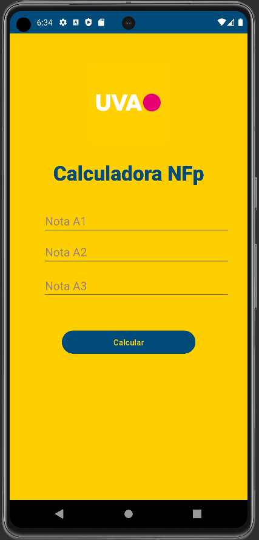
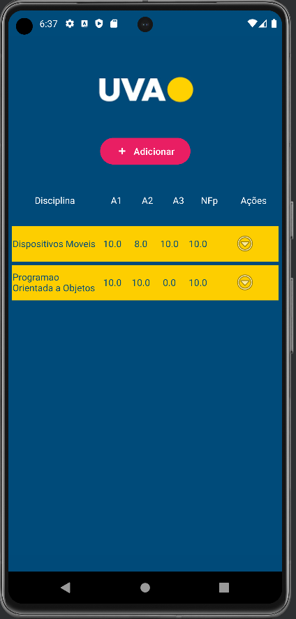
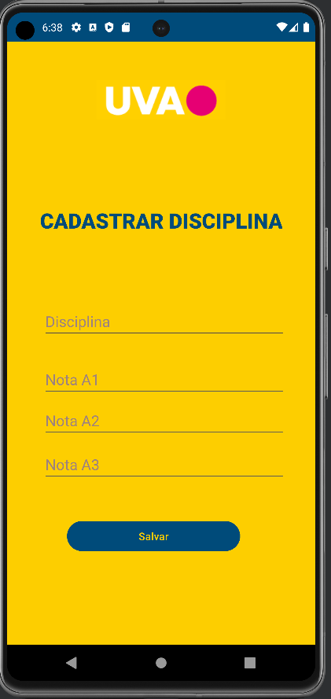

# Aplicativos Android

Aplicativos desenvolvidos para os trabalhos da Univerdidade Veiga de Almeida

## 

## Versões

### v1.0 - Calculadora NFp 

### v2.0 - CRUD Disciplinas 

## Autores

- [@wivsonmachado](https://www.github.com/wivsonmachado)

